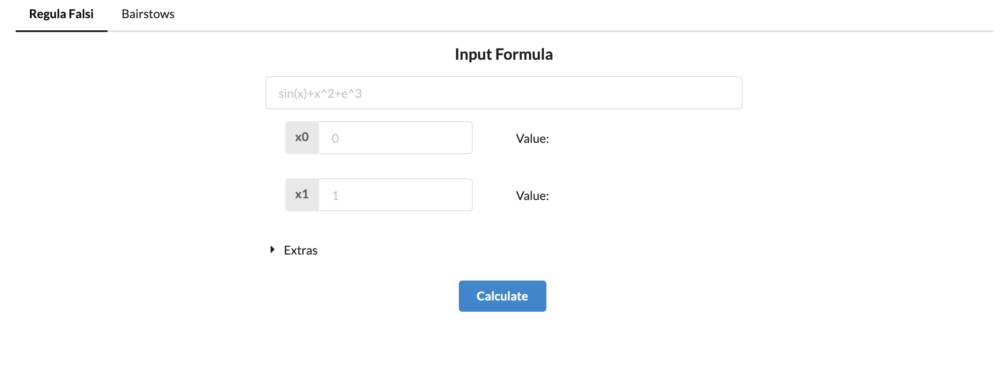
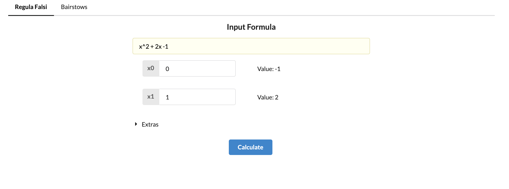
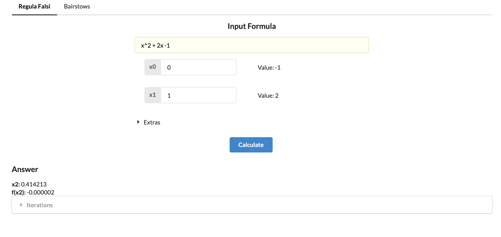
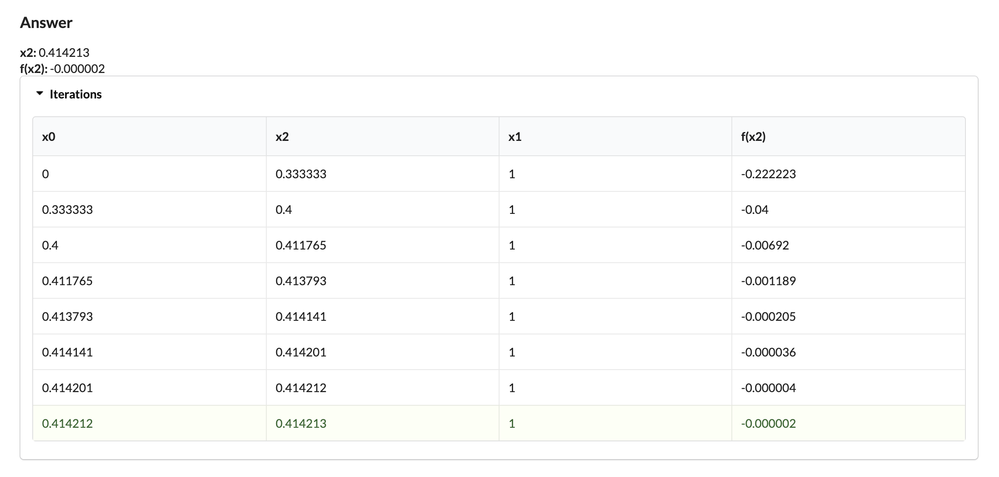
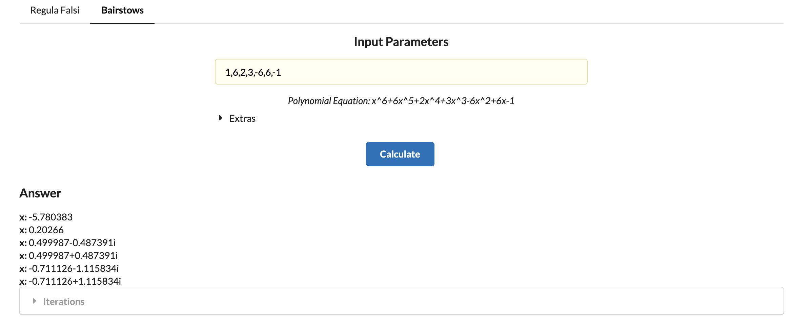
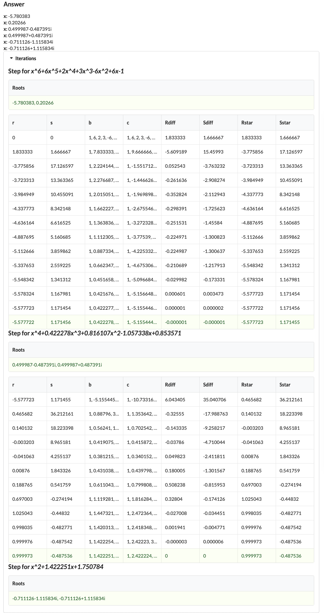

# Math221 - Machine Problem

This project has been deployed to http://deyroproject.s3-website-ap-southeast-1.amazonaws.com/

and the code can also be seen in my personal github repository https://github.com/vdeyro/math221-mp

You can also perform manual build by following React Deployment

## Methods Included

- Regula-Falsi
- Bairstow's

# Usage

## Regula-Falsi

- Access [website](http://deyroproject.s3-website-ap-southeast-1.amazonaws.com/) and pick `Regula-falsi` 

- You can enter the formula and the starting parameters

  - allowed format samples for the formula/equation is as follows
    - basic equations (addition/subtraction/multiplication/division/parenthesis)
      - `x+2` `x-1` `x*x` `x/2` `x(x)` `(3+x)/2`
    - power
      - `x^2` `x^(1/2)` `2^-2`
    - sqrt
      - `sqrt(x)`
    - logarithmic functions
      - `log(x, y)` where y is the base
      - `ln` is not allowed, to replace it we can use `log(x)` which is the same as `log(x,e)`
    - `e` and `pi` constant
      - `e^x` `exp(x)` `pi`
    - trigonometric functions
      - `sin(x)` `cos(x)` `tan(x)`
      - `asin(x)` `acos(x)` `atan(x)`
      - `sinh(x)` `cosh(x)` `tanh(x)`
  - `x` is the only variable that is allowed to get an answer
  - In inputting starting parameters (`x0` and `x1`). please make sure that `x0` has a negative calculated value and `x1` has a positive calculated value to gain the desirable answer.
  - upon applying formula and starting parameters, calculated values will be displayed to help in picking the parameters.
  
- You can also update the `Ea` and `Decimal Places`
  - `Ea` the absolute error _(difference between new x2 and previous x2)_ that will trigger the iteration to end (default: `0.000001`)
  - `Decimal Places` the number of decimal places that will be used for each computation. (default: `6`)

- Click on `Calculate` to get results

  - You can also view the iterations by selecting `Iterations`
  

## Bairstow's Method

- Access [website](http://deyroproject.s3-website-ap-southeast-1.amazonaws.com/) and pick `Bairstow's` 

- You can enter the polynomial parameters separated by commas.

  - E.g.
    - `1,2` = `x + 2`
    - `1,2,1` = `x^2+2x+1`
    - `2,-4,3,-2` = `2x^3-4x^2+3x-2`
  - In inputting polynomial parameters, Polynomial equation will be displayed to help in picking the parameters.
  
- You can also update the `Ea(%)` and `Decimal Places`
  - `Ea(%)` the error % _(percentage difference equated by difference between new `r` and previous `r` over new `r` same with `s` )_ that will trigger the iteration to end (default: `0.0001%`)
  - `Decimal Places` the number of decimal places that will be used for each computation. (default: `6`)

- Click on `Calculate` to get results

  - You can also view the iterations by selecting `Iterations`
  

# Reusability

- When calculating for a different set of paramaters (formula, parameters, error etc.), you can change the formula and parameters and click `calculate` to proceed.

# Limitations

- Invalid formulas can cause the browser to hang when `Calculate` is clicked, if this happens, please close the tab and access again

# REACT README (Used for development and deployment)

This project was bootstrapped with [Create React App](https://github.com/facebook/create-react-app).

## Available Scripts

In the project directory, you can run:

### `yarn start`

Runs the app in the development mode. 
Open [http://localhost:3000](http://localhost:3000) to view it in the browser.

The page will reload if you make edits. 
You will also see any lint errors in the console.

### `yarn test`

Launches the test runner in the interactive watch mode. 
See the section about [running tests](https://facebook.github.io/create-react-app/docs/running-tests) for more information.

### `yarn build`

Builds the app for production to the `build` folder. 
It correctly bundles React in production mode and optimizes the build for the best performance.

The build is minified and the filenames include the hashes. 
Your app is ready to be deployed!

See the section about [deployment](https://facebook.github.io/create-react-app/docs/deployment) for more information.

### `yarn eject`

**Note: this is a one-way operation. Once you `eject`, you can’t go back!**

If you aren’t satisfied with the build tool and configuration choices, you can `eject` at any time. This command will remove the single build dependency from your project.

Instead, it will copy all the configuration files and the transitive dependencies (webpack, Babel, ESLint, etc) right into your project so you have full control over them. All of the commands except `eject` will still work, but they will point to the copied scripts so you can tweak them. At this point you’re on your own.

You don’t have to ever use `eject`. The curated feature set is suitable for small and middle deployments, and you shouldn’t feel obligated to use this feature. However we understand that this tool wouldn’t be useful if you couldn’t customize it when you are ready for it.

## Learn More

You can learn more in the [Create React App documentation](https://facebook.github.io/create-react-app/docs/getting-started).

To learn React, check out the [React documentation](https://reactjs.org/).

### Code Splitting

This section has moved here: https://facebook.github.io/create-react-app/docs/code-splitting

### Analyzing the Bundle Size

This section has moved here: https://facebook.github.io/create-react-app/docs/analyzing-the-bundle-size

### Making a Progressive Web App

This section has moved here: https://facebook.github.io/create-react-app/docs/making-a-progressive-web-app

### Advanced Configuration

This section has moved here: https://facebook.github.io/create-react-app/docs/advanced-configuration

### Deployment

This section has moved here: https://facebook.github.io/create-react-app/docs/deployment

### `yarn build` fails to minify

This section has moved here: https://facebook.github.io/create-react-app/docs/troubleshooting#npm-run-build-fails-to-minify
