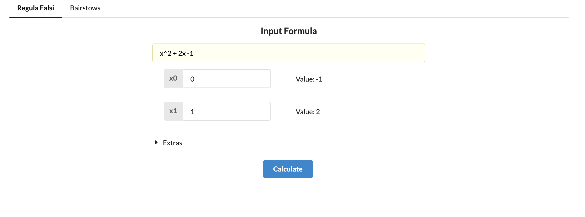
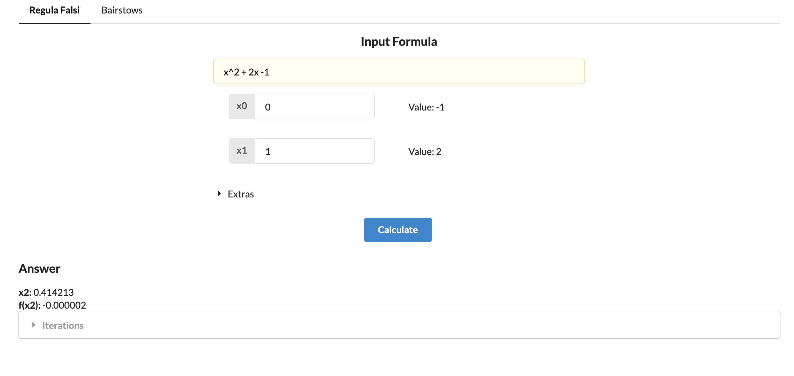
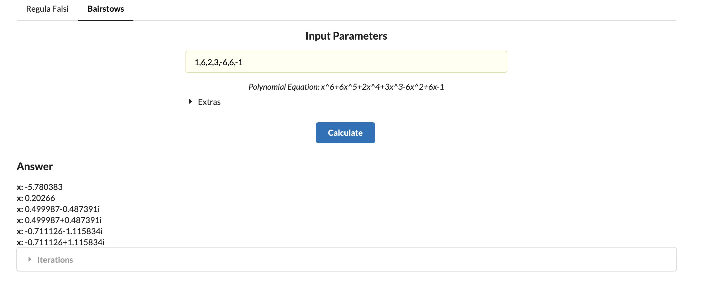
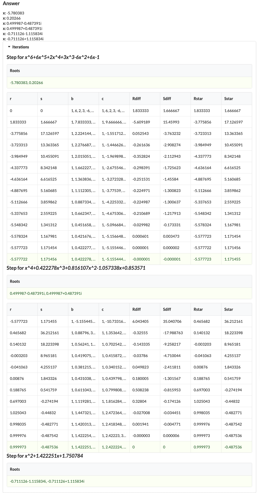

# Usage

Website - http://deyroproject.s3-website-ap-southeast-1.amazonaws.com/

Github - https://github.com/vdeyro/math221-mp

## Regula-Falsi

- Access [website](http://deyroproject.s3-website-ap-southeast-1.amazonaws.com/) and pick `Regula-falsi` 

- You can enter the formula and the starting parameters

  - allowed format samples for the formula/equation is as follows
    - basic equations (addition/subtraction/multiplication/division/parenthesis)
      - `x+2`
    - power
      - `x^2` `x^(1/2)` `2^-2`
    - sqrt
      - `sqrt(x)`
    - logarithmic functions
      - `log(x, y)` where y is the base
      - `ln` is not allowed, to replace it we can use `log(x)` which is the same as `log(x,e)`
    - `e` constant
      - `e^x` `exp(x)`
    - trigonometric functions
      - `sin(x)` `cos(x)` `tan(x)`
      - `asin(x)` `acos(x)` `atan(x)`
      - `sinh(x)` `cosh(x)` `tanh(x)`
  - `x` is the only variable that is allowed to get an answer
  - In inputting starting parameters (`x0` and `x1`). please make sure that `x0` has a negative calculated value and `x1` has a positive calculated value to gain the desirable answer.
  - upon applying formula and starting parameters, calculated values will be displayed to help in picking the parameters.
  
- You can also update the `Ea` and `Decimal Places`
  - `Ea` the absolute error _(difference between new x2 and previous x2)_ that will trigger the iteration to end (default: `0.000001`)
  - `Decimal Places` the number of decimal places that will be used for each computation. (default: `6`)

- Click on `Calculate` to get results

  - You can also view the iterations by selecting `Iterations`
  

## Bairstow's Method

- Access [website](http://deyroproject.s3-website-ap-southeast-1.amazonaws.com/) and pick `Bairstow's` 

- You can enter the polynomial parameters separated by commas.

  - E.g.
    - `1,2` = `x + 2`
    - `1,2,1` = `x^2+2x+1`
    - `2,-4,3,-2` = `2x^3-4x^2+3x-2`
  - In inputting polynomial parameters, Polynomial equation will be displayed to help in picking the parameters.
  
- You can also update the `Ea(%)` and `Decimal Places`
  - `Ea(%)` the error % _(percentage difference equated by difference between new `r` and previous `r` over new `r` same with `s` )_ that will trigger the iteration to end (default: `0.0001%`)
  - `Decimal Places` the number of decimal places that will be used for each computation. (default: `6`)

- Click on `Calculate` to get results

  - You can also view the iterations by selecting `Iterations`
  